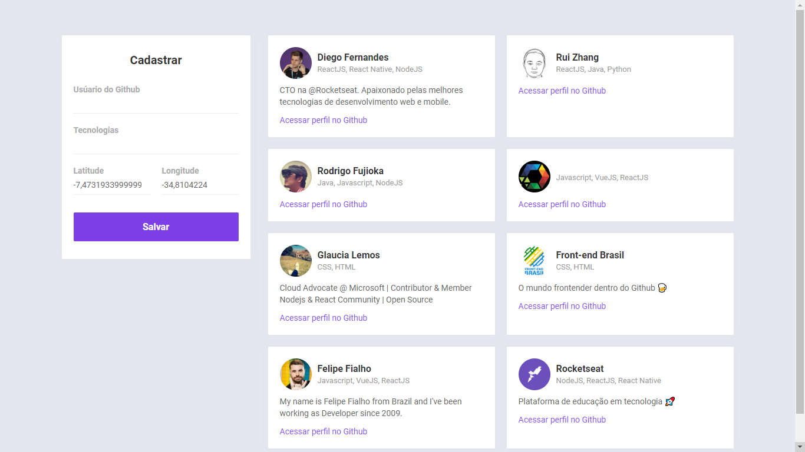

# DevRadar

> Versão Web do DevRadar.

O DevRadar Web tem como objetivo armazenar dados do GitHub dos Devs.



## Installation

NPM:

```sh
npm install
```

```sh
npm start
```

YARN:

```sh
yarn
```

```sh
yarn start
```
